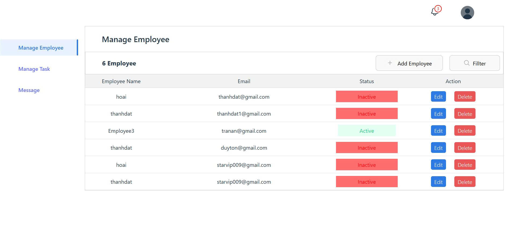
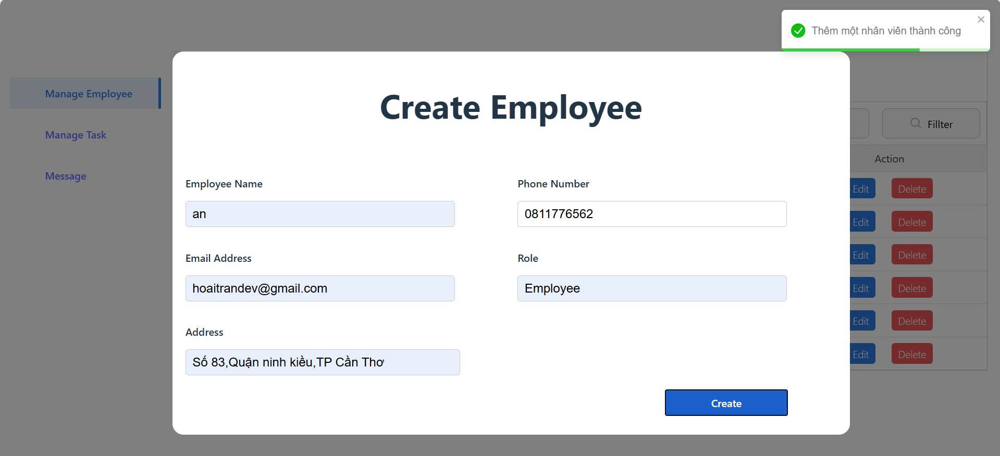
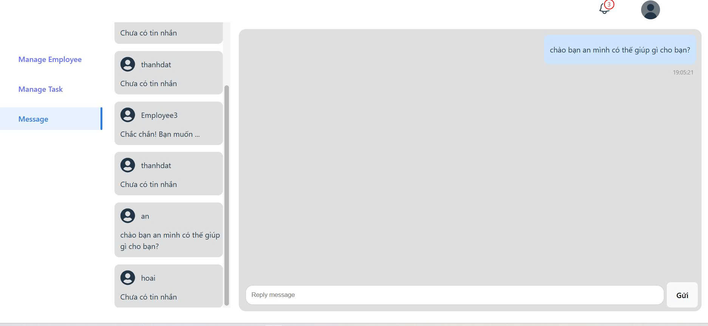
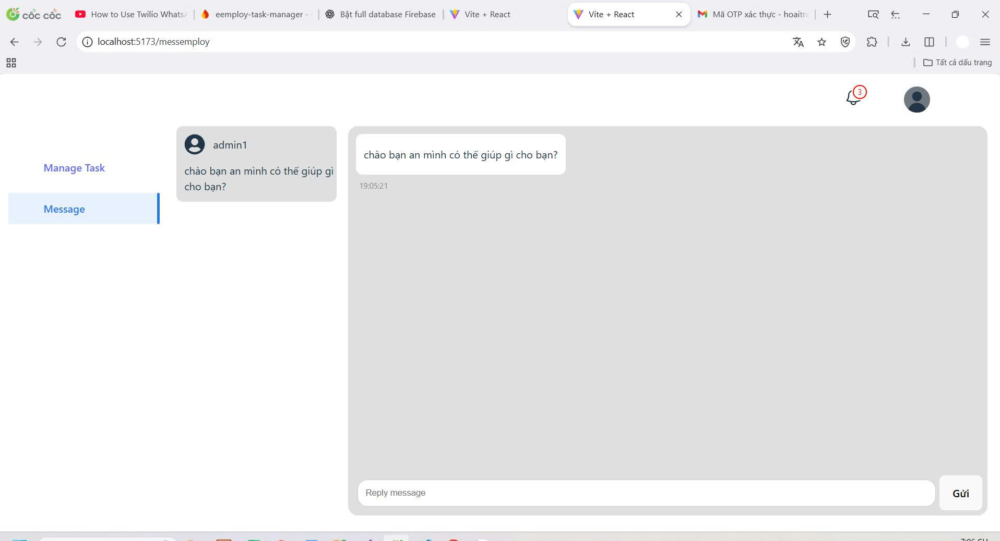

# Employee Management & Realtime Chat System

A **React + Vite** application that allows **admin to manage employees** with features such as phone number login, OTP verification, adding/removing employees, and realtime chat with multiple employees.

---

## 🔹 Main Features

1. **Admin Login via Phone Number**
   - Send OTP code via SMS.
   - Verify OTP to log into the management system.

2. **Employee Management**
   - Add new employees.
   - Delete employees.
   - View employee list.

3. **Realtime Chat**
   - Direct chat between admin and multiple employees.
   - Realtime messaging system using WebSocket / Socket.io.

---

## 🔹 Technologies Used

- **Frontend:** React, Vite, SCSS, React Icons.
- **Realtime Chat:** Socket.io.
- **Backend:** Node.js + Express (APIs for employee management, OTP, chat).
- **Database:** Firebase Firestore.
- **Authentication:** OTP via phone number (Twilio).  
  **Authentication:** OTP via email (Nodemailer).
- **Environment variables:** `.env` to store API keys, OTP token, JWT secret.

---

## 🔹 Project Structure

Frontend:

```
src/
├─ Redux/            # Store temporary state across pages
├─ pages/            # Các trang: Dashboard, Message, Login with SCSS
├─ store/            # Redux hoặc Context
├─ App.jsx
└─ main.jsx
```

Backend (Node.js / Express):
```
nodejs/
├─ config.js                        # Setup Firebase
├─ serviceAccountKey.json           # Api key
└─ index.js                         # Server and controllers for logic
```

---

## 🔹 Installation & Run

1. Clone project:
```bash
git clone <repo-url>
cd project-name
```

2. Install frontend:
```bash
cd Create-React-App
npm run dev
```

3. Install backend:
```bash
cd backend
npm install bcrypt@^6.0.0 cookie-parser@^1.4.7 cors@^2.8.5 dotenv@^17.2.1 express@^5.1.0 firebase@^12.1.0 firebase-admin@^13.4.0 jsonwebtoken@^9.0.2 nodemailer@^7.0.5 nodemon@^3.1.10 socket.io@^4.8.1 socket.io-client@^4.8.1 twilio@^5.8.0
nodemon index.js
```

4. Add .env file with required environment variables:
```
JWT_SECRET=....

TWILIO_ACCOUNT_SID=....
TWILIO_AUTH_TOKEN=...
TWILIO_PHONE_NUMBER=... 

EMAIL_USER=...
EMAIL_PASS=....
```

5. Access the app at: http://localhost:5173 (Vite frontend)

---

## 🔹 Notes

- Make sure backend is running before frontend calls APIs.

- Realtime chat requires Socket.io connection to backend.

- OTP via SMS requires Twilio setup.

- OTP via email requires Nodemailer setup.

---

## 🔹 Screenshots


---


---


---



## 🔹 License
"# Create-React-App" 

"# Create-React-App" 
"# Create-React-App" 
